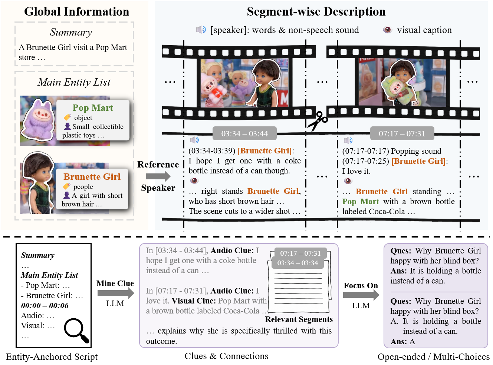
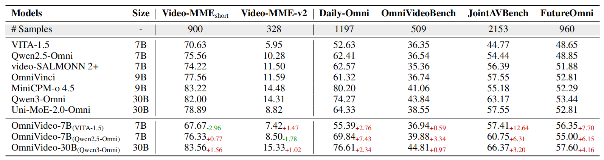
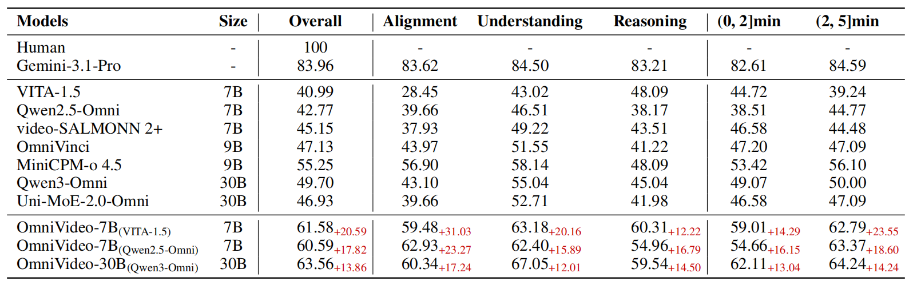

# OmniVideo-100K: A Dataset for Audio-Visual Reasoning through Structured Scripts and Evidence Chains

[](https://yzlmhzz.github.io/OmniVideo-100K/)
[](https://arxiv.org/abs/2606.14702)
[](https://huggingface.co/datasets/MiG-NJU/OmniVideo-100K)
[](https://huggingface.co/datasets/MiG-NJU/OmniVideo-Test)
[](LICENSE)

This is the official repository for the paper **"OmniVideo-100K: A Dataset for Audio-Visual Reasoning through Structured Scripts and Evidence Chains"**. 

We provide an automated data synthesis engine, the large-scale instruction-tuning dataset **OmniVideo-100K**, and the human-verified test set **OmniVideo-Test**.

---

## 🎨 Framework Overview

Current "video-caption-QA" pipelines often suffer from modality bias, temporal misalignment, and narrative incoherence. To address these, we propose an automated data engine featuring two core mechanisms:

1. **Entity-Anchored Video Scripting**: Transforms raw videos into structured, script-like text (summaries, main entity lists, and segment-wise audio-visual descriptions with timestamps), ensuring cross-segment referential consistency and sound-source associations.
2. **Clue-Guided QA Generation**: Prompts MLLMs to first mine cross-segment and cross-modal clues from the script, and subsequently generate complex QA pairs featuring long-term temporal spans and deep cross-modal dependencies.




---

## 📈 Performance on Existing Benchmarks

Models fine-tuned on OmniVideo-100K achieve consistent performance gains across external audio-visual benchmarks (e.g., Daily-Omni, JointAVBench) while preserving their original capabilities on general video benchmarks like Video-MME.



---

## 📚 Dataset: OmniVideo-100K & OmniVideo-Test

Our datasets are designed based on a comprehensive cognitive framework covering 10 tasks across three levels:

* **Alignment**: Fine-Grained Perception (FGP), Scene Transformation Detection (STD).
* **Understanding**: Context Understanding (CU), Comparison (CP), Sentiment Analysis (SA), Event Sequence Ordering (ESO), Summarization (SM).
* **Reasoning**: Causal Reasoning (CR), Future Prediction (FP), Hypothetical Reasoning (HR).

### Directory Structure Requirements

```text
<root_path>/
├── videos/
│   └── ori/                             # Raw videos (.mp4)
├── pre_files/
│   └── final_videos_list.jsonl          # Filtered video list with duration & paths
├── script_files/                        # Intermediate generated scripts
├── script.jsonl                         # Final consolidated structured scripts
└── qa_files/                            # Generated Open-ended & MCQ QA pairs
```

---

## 🛠️ Environment Setup

### 1. Requirements

* OS: Linux recommended
* Python: 3.12+

### 2. Installation

Create a conda environment and install dependencies:

```bash
conda create -n omnivideo python=3.12 -y
conda activate omnivideo

# Install system dependency for audio/video processing
conda install -c conda-forge ffmpeg -y

# Install Python packages
pip install tqdm aiofiles google-genai

# Install LLaMA-Factory for fine-tuning
git clone https://github.com/hiyouga/LLaMA-Factory.git
cd LLaMA-Factory
pip install -e .[metrics,deepspeed]
```

---

## ⚙️ Automated Data Synthesis Pipeline

You can run our pipeline to synthesize structured scripts and QA pairs for your own videos.

### Step 1: Script Generation

```bash
cd omni_train_data_pipeline/gen_script

# 0. Separate Audio/Video & Downsample (Compress video to reduce API load)
python 0_seprate_av.py --root_path <root_path> --num_processes 4 --target_fps 1 --target_max_dim 480

# 1. Extract Multimodal Information (requires API keys)
export API_KEY="your_api_key"
export BASEURL_POOL="https://your-api-gateway.example"
python 1_1_main_entities.py --root_path <root_path>
python 1_2_non_speech.py --root_path <root_path>
python 1_3_transcribe.py --root_path <root_path>

# 2. Add Speaker Labels and Global Summary
python 2_1_label_speaker.py --root_path <root_path>
python 2_2_video_summary.py --root_path <root_path>

# 3. Integrate Segments & Generate Visual Descriptions
python 3_inte_seg.py --root_path <root_path> --max_seg_length 15
python 4_seg_visual.py --root_path <root_path> --num_chunks 6

# 4. Final Formatting Check -> Outputs `<root_path>/script.jsonl`
python 5_check_script.py --root_path <root_path>
```

### Step 2: QA Generation

```bash
cd ../gen_qa

# Generate Open-ended QA for specific tasks (e.g., causal reasoning)
python generate_qa.py --root_path <root_path> --task causal_reasoning
python parse_qa.py --root_path <root_path>

# Generate Multiple-Choice QA (MCQ)
python generate_mcq_2.py --root_path <root_path> --task comparison
python parse_mcq.py --root_path <root_path>
```
---

## 🚀 Model Fine-Tuning

We perform full-parameter fine-tuning on VITA-1.5, Qwen2.5-Omni-7B, and Qwen3-Omni-30B-A3B-Instruct. 

### Hyperparameters

| Model               | Max Pixels |   FPS   | Max Frames | Epochs | Batch Size | Learning Rate | Warmup Ratio |
| :------------------ | :--------: | :-----: | :--------: | :----: | :--------: | :-----------: | :----------: |
| **VITA-1.5**        |  default   | default |  default   |   1    |     32     |     1e-5      |     0.03     |
| **Qwen2.5-Omni-7B** | 448 × 448  |   1.0   |    180     |   1    |     32     |     1e-5      |     0.1      |
| **Qwen3-Omni-30B**  | 256 × 256  |   1.0   |    150     |   1    |     32     |     5e-6      |     0.1      |

### Fine-Tuning with LLaMA-Factory

Example script for fine-tuning **Qwen2.5-Omni-7B** using DeepSpeed Zero-3:

```bash
cd LLaMA-Factory
```

---

## 🧪 Evaluation

To evaluate your fine-tuned models on **OmniVideo-Test**, use our evaluation script:

```bash
python evaluation.py \
    --model_path your_model \
    --eval_dataset omnivideo_test \
    --video_dir <root_path>/videos/ori \
```

### Main Results on OmniVideo-Test

Fine-tuning on OmniVideo-100K yields significant improvements across Alignment, Understanding, and Reasoning tasks.




---

## ✍️ Citation

If you find our data or pipeline useful for your research, please consider citing our paper:

```bibtex
@article{cai2026omnivideo100k,
  title={OmniVideo-100K: A Dataset for Audio-Visual Reasoning through Structured Scripts and Evidence Chains},
  author={Cai, Xinyue and Fu, Chaoyou and Zhang, Yi-Fan and He, Ran and Shan, Caifeng},
  journal={arXiv preprint arXiv:2606.14702},
  year={2026}
}
```

## 📇 Contact

For any questions or feedback, please reach out to:

* Xinyue Cai: yzlmhzz@smail.nju.edu
* Or feel free to open an issue in this repository!